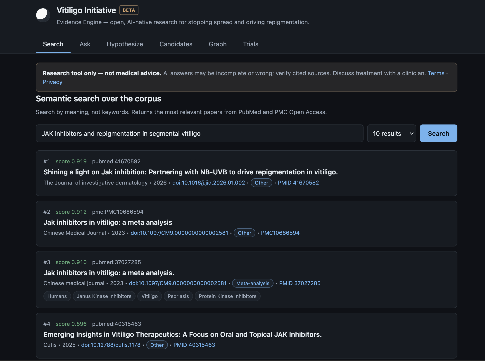
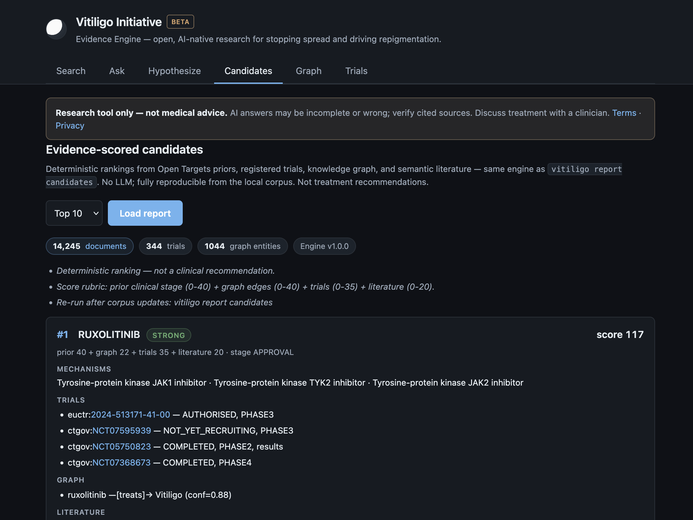
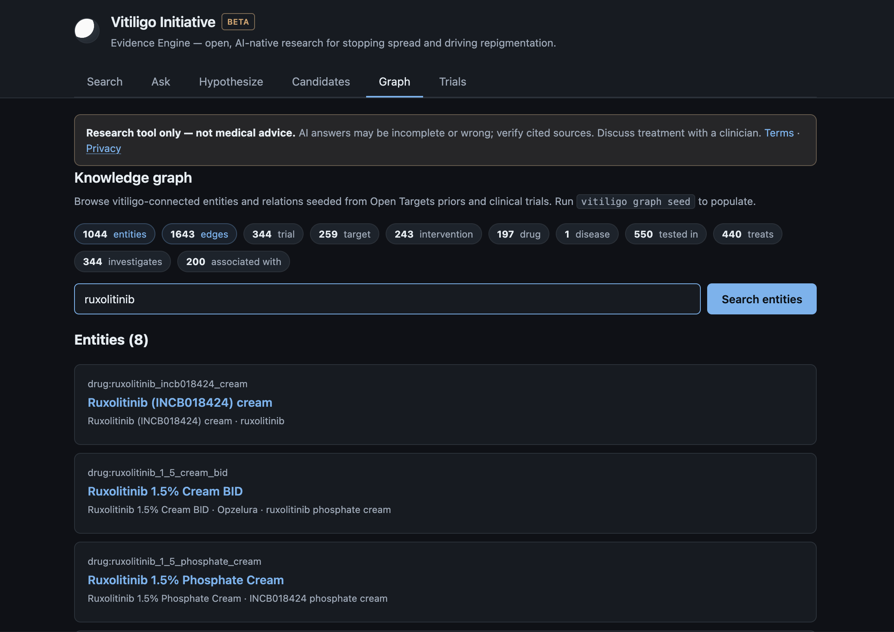
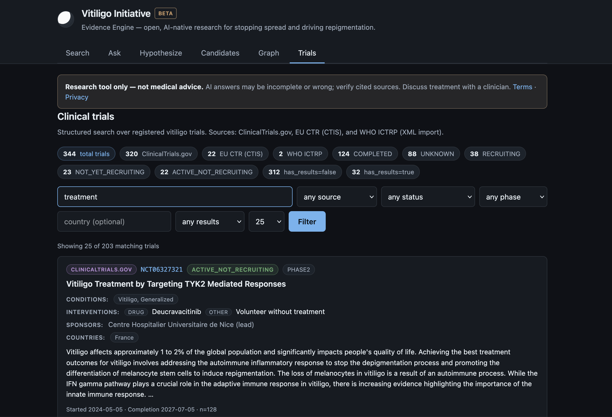
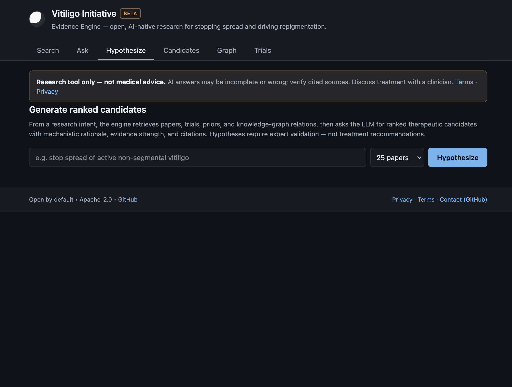
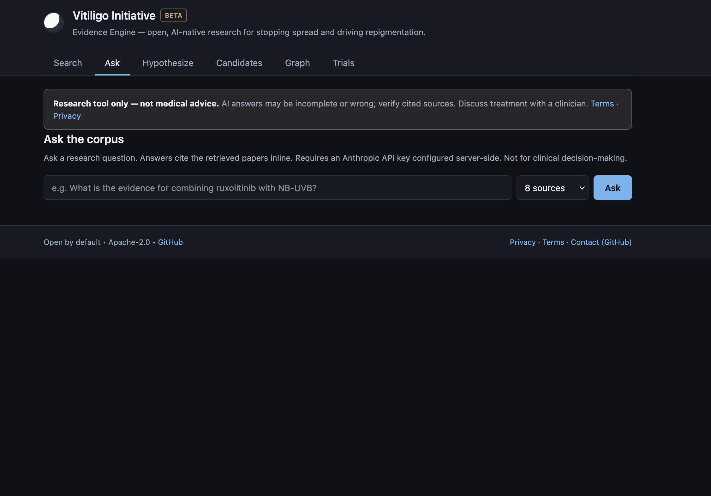
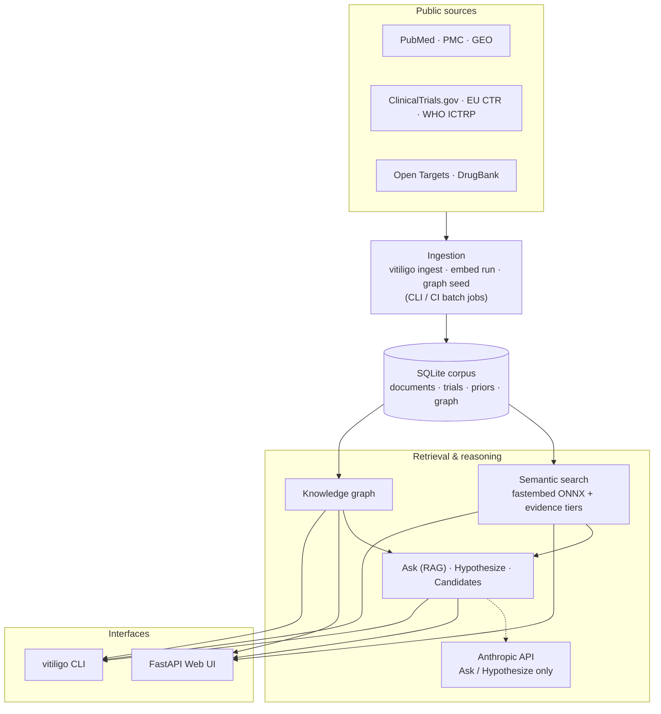

# Vitiligo Initiative

<p>
  <a href="https://github.com/recepsirin/vitiligo-initiative/actions/workflows/ci.yml"></a>
  <a href="LICENSE"></a>
  <a href="https://www.python.org/downloads/"></a>
</p>

> **Open, AI-native vitiligo research.** Unify public literature and trial registries into one corpus, search it by meaning with citations, and run citation-grounded Q&A and ranked therapeutic-hypothesis generation.

Vitiligo evidence is scattered across PubMed, PMC, several trial registries, and genetics resources. The **Evidence Engine** pulls them into a single searchable, citable knowledge base, so researchers and clinicians spend less time hunting for sources and more time reasoning over them.

**At a glance** *(representative local build)* — ~14k indexed documents · 344 registered trials · ~1,000-node knowledge graph · 250 tests · Apache-2.0.

Non-profit initiative context (mission, phases, roadmap): **[docs/strategic-plan.md](docs/strategic-plan.md)**.

## Screenshots

The Evidence Engine ships a FastAPI web UI (`vitiligo serve`) with Search, Ask, Hypothesize, Candidates, Graph, and Trials tabs. Run it locally at <http://127.0.0.1:8765> (see [Quick start](#quick-start)).

<p align="center">
  
</p>

<table>
  <tr>
    <td width="50%"><b>Candidates</b> — deterministic, evidence-scored rankings<br></td>
    <td width="50%"><b>Graph</b> — knowledge-graph browser seeded from priors and trials<br></td>
  </tr>
  <tr>
    <td><b>Trials</b> — cross-registry search with status/phase/country filters<br></td>
    <td><b>Hypothesize</b> — LLM-ranked candidates with multi-stream citations<br></td>
  </tr>
  <tr>
    <td><b>Ask</b> — citation-grounded Q&amp;A over the corpus<br></td>
    <td></td>
  </tr>
</table>


## About this repository

**What it is:** The **Vitiligo Initiative Evidence Engine** — open-source Python software (CLI + FastAPI UI) to ingest public vitiligo literature and trial registries, index them for semantic search, and optionally run citation-grounded Q&A and hypothesis ranking when an Anthropic API key is configured on the server.

**What it is not:** Medical advice, diagnosis, or treatment guidance for individual patients. Outputs are for **research and education** only; verify cited sources and discuss care with a qualified clinician.

**Corpus not in git:** This repository does **not** ship `vitiligo.db`. Build the SQLite corpus locally (see [Quick start](#quick-start)) or use a corpus artifact from a [GitHub release](https://github.com/recepsirin/vitiligo-initiative/releases) when published. Never commit `.env` or API keys.

## Quick start

Requires **Python 3.11+**. Full detail: [`docs/engine.md`](docs/engine.md).

```bash
python3 -m venv .venv && source .venv/bin/activate
pip install -e ".[dev]"

cp .env.example .env   # set NCBI_EMAIL; optional NCBI_API_KEY, ANTHROPIC_API_KEY

vitiligo db init
vitiligo ingest pubmed && vitiligo ingest pmc && vitiligo ingest ctgov
vitiligo embed run && vitiligo graph seed

vitiligo serve   # http://127.0.0.1:8765
```

Or run the full ingest pipeline: `./scripts/ingest/sync-engine.sh` (see [`docs/engine.md`](docs/engine.md)).

Verify locally: `./scripts/deploy/verify-local.sh`

## Example (CLI)

```bash
# Semantic search over the corpus — citations + evidence level per hit
vitiligo search "JAK inhibitor repigmentation in non-segmental vitiligo"

# Citation-grounded answer (requires ANTHROPIC_API_KEY)
vitiligo ask "What is the evidence for combining topical ruxolitinib with NB-UVB?"

# Deterministic, evidence-scored therapeutic candidate ranking
vitiligo report candidates -n 10
```

Every web UI tab has a CLI equivalent — full command reference in [`docs/engine.md`](docs/engine.md).

## Architecture



Five swappable layers — **ingestion → SQLite store → embeddings + graph → reasoning → serving** (CLI + FastAPI). The LLM is optional: it powers only Ask and Hypothesize, while search, graph, and candidate ranking stay fully deterministic. Full diagrams and module map: [`docs/architecture.md`](docs/architecture.md).

## Features

- **Multi-source ingestion** — PubMed, PMC Open Access, GEO, ClinicalTrials.gov, EU CTR (CTIS), Open Targets; optional WHO ICTRP and DrugBank XML imports
- **Semantic search** — ONNX embeddings (`BAAI/bge-small-en-v1.5`) with evidence-level tagging
- **Trial search** — cross-registry filters (status, phase, country, source, free text)
- **Knowledge graph v1** — seeded from priors and trials; optional LLM extraction from abstracts
- **Ask / Hypothesize** — RAG and ranked candidates with paper, trial, prior, and graph citations (requires server-side `ANTHROPIC_API_KEY`)
- **Web UI + CLI** — Search, Ask, Hypothesize, Candidates, Graph, Trials tabs
- **Quality gate** — 250 tests; CI on push ([`.github/workflows/ci.yml`](.github/workflows/ci.yml))

## Corpus

Built locally from public sources (counts from a representative May 2026 build; PubMed grows over time):

| Source | Content | Count |
|--------|---------|------:|
| PubMed | Abstracts + metadata | 11,356 |
| PMC Open Access | Full-text articles | 2,578 |
| GEO | Dataset metadata | 311 |
| ClinicalTrials.gov | Registered trials | 320 |
| EU CTR (CTIS) | Registered trials | 22 |
| Open Targets | Drug / target priors | 237 |
| Embeddings | Vectors (`bge-small-en-v1.5`) | 14,242 |
| Knowledge graph | Entities / edges | 1,044 / 1,643 |

WHO ICTRP and DrugBank are optional XML imports on top. Rebuild anytime with `./scripts/ingest/sync-engine.sh`. Phase gates and release workflow: [`docs/strategic-plan.md#status`](docs/strategic-plan.md#status).

## Documentation


| Doc                                                          | Contents                                                  |
| ------------------------------------------------------------ | --------------------------------------------------------- |
| [`docs/engine.md`](docs/engine.md)                           | Setup, CLI commands, ingestion, env vars                  |
| [`docs/architecture.md`](docs/architecture.md)               | System design and diagrams                                |
| [`docs/deploy.md`](docs/deploy.md)                           | Docker, Render, local-first hosting                       |
| [`docs/strategic-plan.md`](docs/strategic-plan.md)           | Mission, artifacts, phases, roadmap, capability inventory |
| [`docs/scientific-brief.md`](docs/scientific-brief.md)       | Vitiligo state-of-the-art (draft)                         |
| [`docs/candidate-report-v1.md`](docs/candidate-report-v1.md) | Evidence-scored therapeutic candidates                    |
| [`CONTRIBUTING.md`](CONTRIBUTING.md)                         | How to contribute                                         |
| [`SECURITY.md`](SECURITY.md)                                 | Vulnerability reporting                                   |
| [`CHANGELOG.md`](CHANGELOG.md)                               | Release history                                           |


## Status

**Phase 1** — Engine + first public artifact · **v1.0.0** tagged · local-first (public URL deploy deferred).

```bash
./scripts/audit/smoke-all.sh   # full local release gate (ruff + tests + smoke)
```

## Community


|                        |                                                                                                                                                                                        |
| ---------------------- | -------------------------------------------------------------------------------------------------------------------------------------------------------------------------------------- |
| **Contributing**       | [CONTRIBUTING.md](CONTRIBUTING.md) · [Discussions](https://github.com/recepsirin/vitiligo-initiative/discussions) · [Issues](https://github.com/recepsirin/vitiligo-initiative/issues) |
| **Sponsor**            | [GitHub Sponsors](https://github.com/sponsors/recepsirin)                                                                                                                              |
| **License**            | [Apache 2.0](LICENSE) · third-party [NOTICE](NOTICE)                                                                                                                                   |
| **Security / contact** | [SECURITY.md](SECURITY.md) (GitHub Advisories + Discussions until project mail is live)                                                                                                |


## Citation

If you use this software in research, cite the repository and (when available) the methods preprint linked from [`docs/methods-preprint-draft.md`](docs/methods-preprint-draft.md).

---

*Evidence Engine code and docs are open to revision. Initiative strategy: [`docs/strategic-plan.md`](docs/strategic-plan.md).*