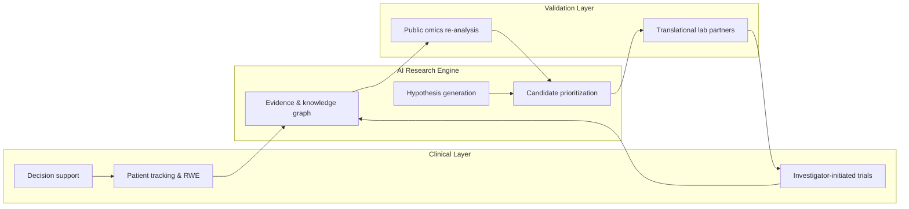
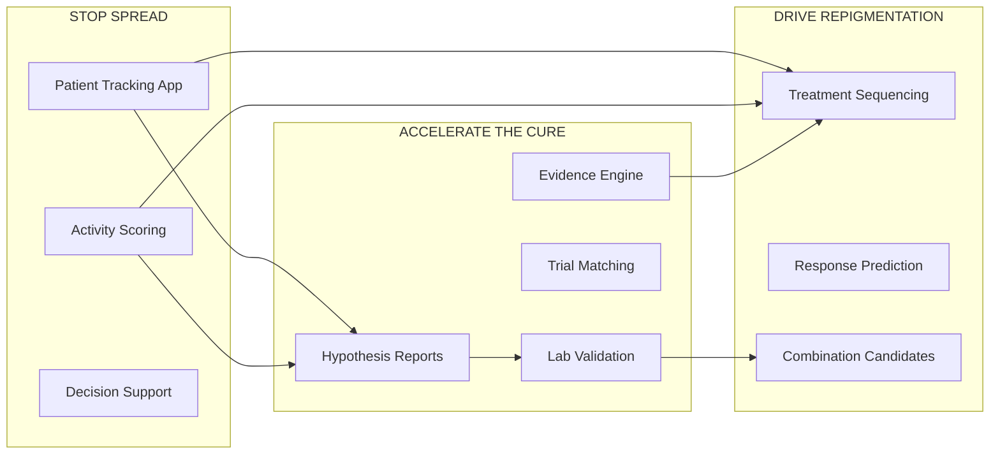

# Vitiligo Initiative

> **Stop the spread of vitiligo and restore pigmentation to affected skin — by using AI to systematically identify, prioritize, and partner to validate the most promising therapeutic candidates, combinations, and protocols, and by deploying the patient and clinician tools that compound that work.**

## About this repository

**What it is:** The **Vitiligo Initiative Evidence Engine** — open-source Python software (CLI + FastAPI UI) to ingest public vitiligo literature and trial registries, index them for semantic search, and optionally run citation-grounded Q&A and hypothesis ranking when an Anthropic API key is configured on the server.

**What it is not:** Medical advice, diagnosis, or treatment guidance for individual patients. Outputs are for **research and education** only; verify cited sources and discuss care with a qualified clinician.

**Corpus not in git:** This repository does **not** ship `vitiligo.db`. Build the SQLite corpus locally ([`docs/engine.md`](docs/engine.md): `vitiligo ingest`, `vitiligo embed run`, `vitiligo graph seed`) or use a corpus artifact from a [GitHub release](https://github.com/recepsirin/vitiligo-initiative/releases) when published. Never commit `.env` or API keys.

| | |
|---|---|
| **Run locally** | [`docs/engine.md`](docs/engine.md) quickstart → `vitiligo serve` at http://127.0.0.1:8765 |
| **Architecture** | [`docs/architecture.md`](docs/architecture.md) |
| **Deploy** | [`docs/deploy.md`](docs/deploy.md) (Render / Docker; static corpus on disk) |
| **License** | [Apache 2.0](LICENSE) · third-party [NOTICE](NOTICE) |
| **Contributing** | [CONTRIBUTING.md](CONTRIBUTING.md) · [Discussions](https://github.com/recepsirin/vitiligo-initiative/discussions) |
| **Sponsor** | [GitHub Sponsors](https://github.com/sponsors/recepsirin) (supports open vitiligo research tooling) |
| **Security** | [SECURITY.md](SECURITY.md) |
| **Contact** | **Parked** — domain not purchased yet. Security: [SECURITY.md](SECURITY.md) (GitHub for now). Planned: `contact@` / `privacy@` on `vitiligo-initiative.org` |

Below this section, the README remains a **living planning document** for the broader non-profit initiative (mission, strategy, phases). Everything is open to challenge and revision.

---

## Table of Contents

- [About this repository](#about-this-repository)
- [Mission](#mission)
- [Strategic Objectives](#strategic-objectives)
- [Non-Goals](#non-goals)
- [Strategic Logic](#strategic-logic)
- [What We Build (Artifacts)](#what-we-build-artifacts)
- [What We Share, Where, and How](#what-we-share-where-and-how)
- [Outcomes](#outcomes)
- [Operating Principles](#operating-principles)
- [Phases of Work](#phases-of-work)
- [Open Questions](#open-questions)
- [Status](#status)

---

## Mission

Meaningfully advance vitiligo treatment toward **durable spread arrest** and **reliable repigmentation** — for real patients, on the shortest defensible timeline.

We do this as a focused non-profit, AI-native research organization. We combine:

- **An AI engine** that generates and prioritizes therapeutic hypotheses,
- **Translational lab partnerships** that validate them,
- **Clinical collaborations** that translate them into trials and practice,
- **Patient and clinician tools** that improve care today and generate the real-world data that compounds the engine.

We are not a chatbot for vitiligo. We are not a startup. We are not a drug company. We are a research initiative whose primary output is **evidence and validated candidates that advance the field toward the cure**, and whose secondary output is **tools that help patients and clinicians today**.

---

## Strategic Objectives

1. **Identify** novel and repurposed therapeutic candidates and combinations for spread arrest and repigmentation, ranked by mechanistic plausibility, safety, and feasibility — with full evidence trails.
2. **Validate** the highest-ranked candidates through partnerships with translational laboratories (melanocyte / T-cell co-culture, organoid, animal models).
3. **Translate** validated candidates into investigator-initiated clinical trials, in collaboration with vitiligo specialist clinics.
4. **Compound** the work by deploying patient tracking, decision support, evidence engine, and trial matching tools that generate the real-world data and field credibility feeding back into the engine.
5. **Publish** rigorously and openly — peer-reviewed papers, preprints, datasets, and code — so the field benefits even where we do not directly succeed.

---

## Non-Goals

Stated explicitly to prevent drift.

- ❌ Not building a drug company in early phases (no in-house wet lab, no IND ownership).
- ❌ Not making diagnostic claims (no Software-as-a-Medical-Device classification in early phases).
- ❌ Not claiming to "cure" anything until evidence supports it.
- ❌ Not competing with existing vitiligo non-profits (Global Vitiligo Foundation, VR Foundation, VITFriends, Vitiligo Research Foundation) — we complement and partner.
- ❌ Not building a generic "AI health platform" — vitiligo-focused, depth over breadth.
- ❌ Not pursuing closed commercial IP at the cost of mission — open by default, IP only where it directly accelerates the cure.
- ❌ Not using marketing or hype language — scientific tone, evidence-driven, limits stated explicitly.

---

## Strategic Logic



The loop is the point. Each cycle makes the engine smarter and the next cycle cheaper. AI compresses the **building** phase 10–100x. It does not compress biology, IRB review, peer review, or patient enrollment — those run in parallel from the start.

---

## What We Build (Artifacts)

Concrete deliverables. No vagueness.

| # | Artifact | Form | Cure-relevance |
|---|---|---|---|
| 1 | **Vitiligo Knowledge Graph** | Machine-readable dataset: drugs, targets, pathways, trials, outcomes, subtypes | Foundation for everything |
| 2 | **Evidence Engine** | Public web app + open API; cited Q&A over vitiligo literature | Researchers + clinicians save months |
| 3 | **Candidate Hypothesis Reports** | Ranked repurposing candidates, combinations, targets with full mechanistic rationale | **Direct cure relevance** — these go to labs |
| 4 | **Omics Re-analysis Findings** | Computational biomarker / target discoveries from public datasets (GEO, ArrayExpress) | New target candidates the field hasn't explored |
| 5 | **Automated VASI + Activity Scoring** | Open-source CV model + web tool; standardized vitiligo outcome measurement | Trials get comparable; spread detected earlier |
| 6 | **Patient Tracking App** | Mobile / web app; serial lesion photos, change detection, spread alerts | Patients directly benefit; generates real-world data |
| 7 | **Clinical Decision Support Tool** | Web app for clinicians; evidence-ranked treatment sequencing | Better outcomes in practice today |
| 8 | **Trial Matching Tool** | Public web tool; patient profile → eligible trials worldwide | Accelerates trial enrollment |
| 9 | **Real-World Evidence Reports** | Periodic published analyses of registry data | Shifts treatment guidelines; informs pharma |
| 10 | **Peer-Reviewed Publications** | Methods papers, validation studies, evidence syntheses, hypothesis papers | Field credibility; permanent contribution |
| 11 | **Open Datasets** | Anonymized registry data, knowledge graph snapshots, model outputs | Multiplier — others build on top |
| 12 | **Annual Research Priorities Report** | Field state + research gaps + recommended priorities | Coordinates funding and effort across the field |

### Mapping artifacts to the two primary goals



---

## What We Share, Where, and How

### What

Every artifact in the table above, plus methods, code, and findings.

### Where

**Public-facing channels (free, open, no gatekeeping):**

| Channel | What goes here | Audience |
|---|---|---|
| Project website | Evidence Engine, decision support, trial matching, all reports, mission docs | Everyone |
| GitHub | All non-sensitive code, Apache 2.0 / MIT | Developers, researchers |
| Hugging Face | Model weights, datasets, knowledge graph snapshots | ML community |
| Zenodo | Citable DOIs for every dataset and code release | Academic citations |
| bioRxiv / medRxiv | Preprints — *before* peer review for speed | Researchers (immediate) |
| OSF | Registered protocols, study materials | Reproducibility |

**Peer-reviewed venues (slower, higher credibility):**

| Venue | What | Why |
|---|---|---|
| JAAD | Clinical findings, decision support validation | Dermatologist audience |
| JID | Mechanistic / translational findings | Vitiligo researcher core |
| Pigment Cell & Melanoma Research | Melanocyte biology, pigmentation | Specialist core |
| JCI Insight / Cell Reports Medicine | High-impact translational results | Field-wide visibility |
| The Lancet Digital Health / npj Digital Medicine | AI/digital health tooling validation | Digital health credibility |
| British Journal of Dermatology | Clinical and methods work | European derm community |

**Patient + clinician engagement:**

| Channel | What | Cadence |
|---|---|---|
| App stores (iOS / Android) | Patient Tracking App | Continuous |
| Patient advocacy partners (GVF, VR Foundation, VITFriends) | Embedded tools, joint communications | Ongoing |
| Clinician CME / webinars | Decision support training, evidence updates | Quarterly |
| Patient communities (Reddit, Discord, Facebook groups) | Authentic engagement, listening, education | Ongoing |

**Conferences (where the field meets in person):**

- AAD Annual Meeting (March)
- EADV Congress (September/October)
- World Congress on Vitiligo / Vitiligo International Symposium (annual)
- SID — Society for Investigative Dermatology (May)
- IPCC — International Pigment Cell Conference (biennial)

**Targeted private channels:**

- Direct outreach to specific translational labs (Harris, Le Poole, Picardo, van Geel, Taïeb, etc.) with candidate hypothesis reports
- Pharma BD conversations (Incyte, Pfizer, AbbVie, smaller vitiligo programs) for RWE / trial matching partnerships
- Funder briefings (VR Foundation, NIH NIAMS, CZI, Wellcome, Open Philanthropy)
- Regulatory pre-submission meetings (FDA / EMA) — when/if we approach a SaMD line

### How

**Licensing (decided once, applied everywhere):**

| Asset type | License |
|---|---|
| Source code | [Apache 2.0](LICENSE) — see also [NOTICE](NOTICE) for embedding stack |
| Datasets (non-patient) | CC-BY 4.0 |
| Models | Open weights, permissive license |
| Patient-derived datasets | Controlled access via Data Use Agreement (UK Biobank-style) |
| Publications | Open access (gold or green) — non-negotiable |
| Knowledge graph | CC-BY 4.0 |

**Versioning and accountability:**

- Every release has a version, date, citable DOI (via Zenodo).
- Every claim in a public tool links to source citations with evidence level.
- Changelogs are public.
- Validation reports for every model published alongside the tool itself.
- Methods are reproducible; others can rerun our analyses.

**Tone and framing:**

- Scientific, not promotional. No "revolutionary," "breakthrough," or AI-hype language.
- Limits stated explicitly. Every tool has a "where this works, where it doesn't" section.
- Patient-respectful. Real patient voices included with consent; never exploited.
- Clinician-respectful. Tools described as decision aids, not replacements.
- Researcher-respectful. Credits collaborators prominently; never claims others' work.

---

## Outcomes

Laddered honestly from immediate to ultimate, with realistic probability.

### Immediate outcomes (first months) — high probability

- Hundreds to thousands of patients using the tracking app, getting earlier signals of spread.
- Dozens of clinicians using decision support for more evidence-based treatment sequencing.
- Researchers worldwide querying the Evidence Engine, saving months on literature review per project.
- The field has a standardized, open VASI scoring tool — every future trial can use it.
- Several KOL dermatologists engaged as advisors or collaborators.
- Initial peer-reviewed papers submitted or published.
- First grant funding secured; organization sustainable.

### Medium-term outcomes (next phase) — medium probability

- 1–3 candidate compounds or combinations identified by the engine have entered formal lab validation with partners.
- First in vitro / animal validation results published — positive or negative, both valuable.
- First investigator-initiated clinical trial designed and funded based on our candidate identification work.
- Real-world evidence dataset of thousands of patients influencing clinical practice and trial design.
- Recognized as a serious vitiligo research entity, invited to consortia, cited in guidelines.
- Pharma paying for real-world data and trial-matching services — sustainable revenue.

### Long-term outcomes — lower probability, higher impact

- A clinical trial of an AI-identified candidate or combination produces positive results.
- A new treatment option reaches patients (approval, off-label adoption, guideline change).
- Vitiligo's treatment ceiling rises — better repigmentation on hard sites (hands, face), durable spread arrest in more patients.
- Methodology becomes a template for other autoimmune skin diseases.

### Ultimate outcome — the cure-class goal

Vitiligo becomes a **treatable, durably controllable, often reversible disease for the majority of patients.** Most patients can achieve and maintain repigmentation with safe, accessible therapies. Active spread is reliably stopped early.

This is what "cure" actually looks like in practice — not one pill, but a reliable set of therapies that work for most patients most of the time. We can be one of the entities that materially contributed to making it happen.

### What we are honestly promising

Three tiers, each truthful at its own level:

1. **We will absolutely** ship open tools that help vitiligo patients and clinicians make better decisions today, and accelerate vitiligo research worldwide.
2. **We will likely** identify and validate at least one new therapeutic candidate or combination that advances toward clinical evaluation.
3. **We may** materially contribute to the eventual cure of vitiligo.

We tell every audience the truth at the appropriate tier.

### The one-sentence outcome

> **Vitiligo patients have better tools and better treatments — and the field reaches durable spread control and reliable repigmentation faster, in part because of work we did.**

---

## Operating Principles

1. **Cure-relevance is the design goal**, not retrofitted. Every artifact is asked: how does this contribute to stopping spread, restoring pigment, or accelerating the cure?
2. **Open by default.** Code, data, methods, findings — public unless there's a specific reason to restrict.
3. **Scientific integrity over speed.** AI generates; biology validates; peer review confirms. We never publish unvalidated claims as findings.
4. **Patient safety and ethics first.** IRB governance for any patient data. Consent-driven. HIPAA / GDPR compliant.
5. **Credibility is compounded, not claimed.** KOL advisors before clinical claims. Peer-reviewed papers before public claims. Validation studies before tool launches.
6. **Honest about limits.** Under-promise, over-deliver. State what tools cannot do as clearly as what they can.
7. **Agility within rigor.** Move fast where AI compresses time. Hold the line on validation and ethics.
8. **Mission > organization.** If a partner can do something better than us, we help them do it.

---

## Phases of Work

We move agilely. Phases are sequenced by dependency, not calendar — each gates the next, and we move on as soon as the gate condition is met.

### Phase 0 — Foundation

**Goal:** Sharp objective, scientific literacy, written planning artifacts.

Gate conditions:
- [ ] Mission and objectives document finalized (this README is v0)
- [x] Scientific brief on vitiligo state-of-the-art completed ([`docs/scientific-brief.md`](docs/scientific-brief.md) — draft v0.1)
- [x] Governance and ethics brief drafted ([`docs/governance-ethics-brief.md`](docs/governance-ethics-brief.md) — draft v0.1)
- [ ] Strategic plan finalized
- [ ] Open questions resolved (see [Open Questions](#open-questions))

### Phase 1 — Engine + First Public Artifact

**Goal:** Working AI engine that generates ranked, cited candidates and answers — public and demonstrable.

Gate conditions:
- [x] Literature corpus ingested (PubMed, PMC OA, ClinicalTrials.gov, Open Targets, DrugBank; GEO metadata via `vitiligo ingest geo`)
- [x] Knowledge graph v1 built (structured seed from priors + trials; LLM extraction available)
- [x] Knowledge graph v1 spot-checked (`./scripts/review/graph-spotcheck.sh` passes; skim `exports/graph-review.json` before KOL share)
- [ ] Evidence Engine v1 deployed at a public URL
- [x] Hypothesis-generation layer producing ranked candidate reports
- [ ] First KOL advisor meeting held *with the tool in hand*

### Phase 2 — Validation Path

**Goal:** Move from "we have hypotheses" to "they are being validated."

Gate conditions:
- [ ] Top 5–10 candidates ranked with full rationale ([`docs/candidate-report-v1.md`](docs/candidate-report-v1.md) — deterministic v1; advisor + LLM review pending)
- [ ] Outreach to translational labs with concrete validation proposals
- [ ] At least one lab partnership agreement signed
- [ ] First validation study funded and starting

In parallel:
- [ ] IRB application for registry submitted
- [ ] Omics re-analysis underway

### Phase 3 — Clinical and Patient Tools

**Goal:** Tools reaching real patients and clinicians; real-world data flowing.

Gate conditions:
- [ ] Automated VASI scoring tool open-sourced and validated
- [ ] Patient Tracking App live (wellness/research framing)
- [ ] Decision support tool deployed for advisor + partner-clinician use
- [ ] Registry enrolling patients
- [ ] Trial matching tool live

### Phase 4 — Evidence and Field Engagement

**Goal:** Peer-reviewed credibility and field adoption.

Gate conditions:
- [ ] First peer-reviewed paper submitted (likely methods or evidence synthesis)
- [ ] First conference presentation (AAD / EADV / vitiligo-specific)
- [ ] First real-world evidence report drafted from registry
- [ ] Field recognition: cited, invited, included in consortia

### Phase 5 — Translation

**Goal:** AI-identified candidates moving toward and into clinical evaluation.

Gate conditions:
- [ ] Validation results published (positive or negative)
- [ ] First investigator-initiated trial designed
- [ ] Trial funding secured (grants + venture philanthropy)
- [ ] Trial enrolling

---

## Open Questions

These shape execution and must be resolved before some downstream decisions. Tracked here so we don't forget them.

### Personal / team
- [ ] Time commitment (full-time vs. part-time vs. evenings)
- [ ] Co-founders / team members
- [ ] Geography / base of operations
- [ ] Personal connection to vitiligo (informs authenticity and patient engagement)
- [ ] Financial runway for first months

### Strategic
- [ ] Risk tolerance: hybrid model (AI + biology partnerships) accepted? (working assumption: yes)
- [ ] Geographic scope: global from day one or start regional
- [ ] Openness stance: fully open vs. open core
- [ ] Speed vs. credibility tradeoff for Evidence Engine launch (public early vs. private with advisors first)

### Operational
- [ ] Legal structure: US 501(c)(3), EU foundation, fiscal sponsorship, or undecided
- [ ] Working organization name (current placeholder: "Vitiligo Initiative")
- [ ] Initial advisors and how to approach them

---

## Status

**Current phase:** Phase 1 — Engine + First Public Artifact (in progress)
**Last updated:** May 2026
**Document version:** v1.0

### What exists

- **Planning artifact** — this README.
- **AI engine v1.0 — Evidence Engine + Knowledge Graph:**
  - **PubMed ingestion** — full vitiligo corpus, **11,356 records** with abstracts, MeSH terms, authors, DOIs. Auto-handles NCBI's 9,999-result query cap by year-bisection.
  - **PMC Open Access ingestion** — **2,578 full-text articles** with structured sections (intro / methods / results / discussion).
  - **GEO ingestion** — **311 vitiligo-linked GEO DataSets** (GSE series metadata: title, summary, organism, sample counts) via `vitiligo ingest geo`.
  - **ClinicalTrials.gov ingestion** — **320 vitiligo trials** with structured status, phase, conditions, interventions, sponsors, locations, eligibility, primary/secondary outcomes, enrollment, and dates.
  - **EU CTR (CTIS) ingestion** — **22 EU vitiligo trials** with normalized phases, statuses, sponsors, countries, full eligibility criteria, and trial objectives — including the active Phase 3 EU trials of ruxolitinib, povorcitinib, and upadacitinib in non-segmental vitiligo.
  - **Open Targets ingestion** — **237 drug/target priors** for vitiligo (`EFO_0004208`): 37 clinical drug candidates (ruxolitinib, povorcitinib, upadacitinib, ritlecitinib, …) plus top 200 associated gene targets with association scores and mechanism-of-action enrichment.
  - **WHO ICTRP ingestion (XML file import)** — import global trial records from https://trialsearch.who.int/ exports; deduplicates against existing ClinicalTrials.gov and EU CTR rows.
  - **DrugBank ingestion (XML file import)** — vitiligo-filtered drug/target priors with mechanisms from a local full-database XML export (academic license); seeds from Open Targets drug names by default.
  - **Source-agnostic SQLite store** for documents, embeddings, trials, and priors; bookkeeping for resumable, idempotent ingestion runs across all sources.
  - **Embeddings** — fastembed (ONNX, no torch) with `BAAI/bge-small-en-v1.5`; **14,242 vectors** across PubMed, PMC, and GEO.
  - **Semantic search** over papers with evidence-level tagging and evidence-adjusted ranking (mouse/in-vitro downrank); **structured search** over trials with cross-registry filtering (source / status / phase / country / has-results / free-text).
  - **RAG with citations** (`vitiligo ask`) — Claude-backed answers with bracketed numeric citations into the retrieved papers; refuses to invent facts.
  - **Knowledge graph v1** (`vitiligo graph`) — persisted entity–relation store seeded deterministically from Open Targets priors and clinical trials (1,044 entities, 1,643 edges on the local corpus); optional LLM extraction from paper abstracts; queryable via CLI and `/api/graph/*`; fourth Hypothesize evidence stream with `[Gn]` graph citations.
  - **Hypothesis generation with four evidence streams** (`vitiligo hypothesize`) — Claude-backed extraction of ranked therapeutic candidates over literature, registered clinical trials, Open Targets priors, AND knowledge-graph relations, with separate paper [n], trial [Tn], prior [Pn], and graph [Gn] citations.
  - **Web UI** (`vitiligo serve`) — FastAPI Evidence Engine with Search / Ask / Hypothesize / Graph / Trials tabs. **Local-first for now** (`vitiligo serve` + KOL screen share). Public hosting planned on **DigitalOcean** — see [`docs/deploy.md`](docs/deploy.md).
  - **Typed CLI**, ruff-clean, **250 tests** (CI: ~158 fast + ~76 confidence; corpus + smoke local-only), Apache-2.0 licensed; GitHub Actions CI on push.
  - **Candidate report v1** — evidence-scored rankings: [`docs/candidate-report-v1.md`](docs/candidate-report-v1.md) (`vitiligo report candidates`); **Candidates** tab in web UI.
  - **Validation proposals** — lab outreach one-pagers: [`docs/validation-proposals/`](docs/validation-proposals/).
- **Engineering docs** — [`docs/engine.md`](docs/engine.md) (quickstart); [`docs/architecture.md`](docs/architecture.md) (system diagrams).
- **Planning briefs** — [`docs/scientific-brief.md`](docs/scientific-brief.md), [`docs/governance-ethics-brief.md`](docs/governance-ethics-brief.md), [`docs/kol-meeting-prep.md`](docs/kol-meeting-prep.md), [`docs/methods-preprint-outline.md`](docs/methods-preprint-outline.md), [`docs/methods-preprint-draft.md`](docs/methods-preprint-draft.md), [`docs/advisor-outreach.md`](docs/advisor-outreach.md), [`docs/release-checklist-v1.0.0.md`](docs/release-checklist-v1.0.0.md) (drafts for advisor review).

### Release & advisor demo (v1.0.0 local-first)

Tagged release **v1.0.0** — local-first, no public URL required for advisor review.

```bash
# Full local release gate (ruff + all tests + confidence + smoke)
./scripts/audit/smoke-all.sh

# Advisor share pack → exports/kol-share-YYYYMMDD.tar.gz
./scripts/review/kol-share-pack.sh

# Screen-share demo
vitiligo serve &
./scripts/deploy/verify-local.sh
```

**GitHub releases:** push an annotated `v*` tag — [`.github/workflows/release.yml`](.github/workflows/release.yml) publishes automatically. Local fallback: `./scripts/release/create-github-release.sh vX.Y.Z` (requires `gh`).

**Advisor labels → CI manifest:** label `exports/retrieval-eval.json`, then `python scripts/review/promote-eval-to-manifest.py exports/retrieval-eval.json --update --apply`, rebuild regression DB, `pytest -m confidence`. See [`tests/README.md`](tests/README.md).

### Immediate next moves

1. **KOL meeting** — attach `exports/kol-share-*.tar.gz` from `./scripts/review/kol-share-pack.sh`; [`docs/advisor-outreach.md`](docs/advisor-outreach.md)
2. **Advisor review** — label `retrieval-eval.json`; promote with `--update --apply` when expectations change
3. **Local demo** — `vitiligo serve` + `./scripts/deploy/verify-local.sh` for screen-share sessions
4. **Methods preprint** — complete Methods section after advisor feedback

## How to Read This Document

This is a **living planning artifact**, not a public mission statement (yet). It is intentionally:

- **Honest about probabilities** — we ladder claims realistically.
- **Honest about limits** — we name what AI does and does not compress.
- **Honest about non-goals** — what we will *not* do is as important as what we will.
- **Open to challenge** — any section should be pushed back on if it's wrong.

When this matures and stabilizes, sections will be split out into purpose-built documents (mission statement, scientific brief, strategic plan, governance brief). For now, one README holds the thinking.

---

*This document is open to revision. Push back on anything that doesn't hold up.*
