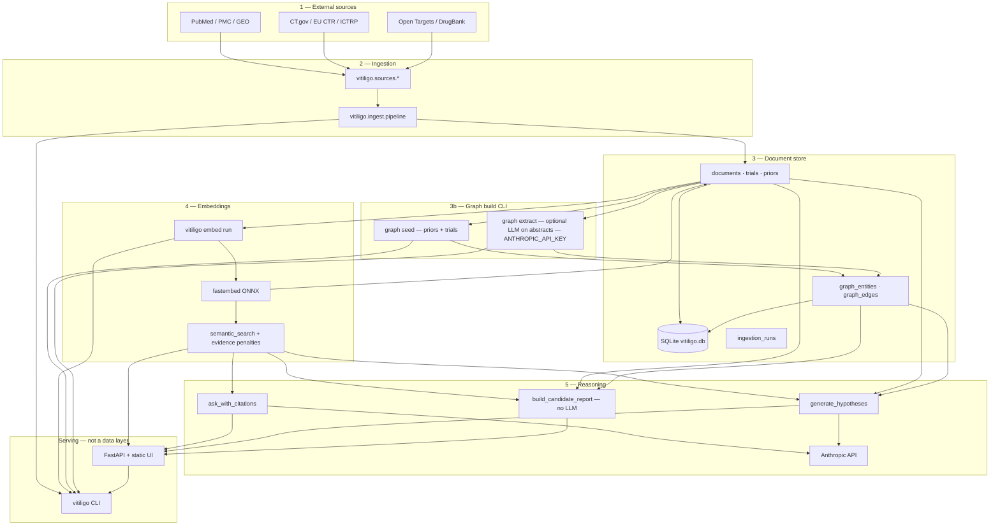
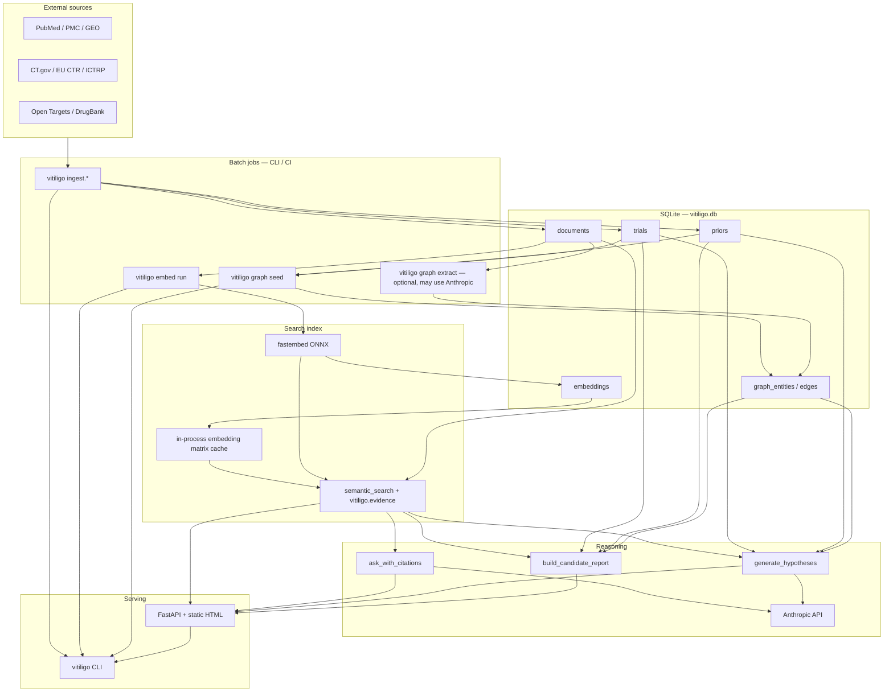
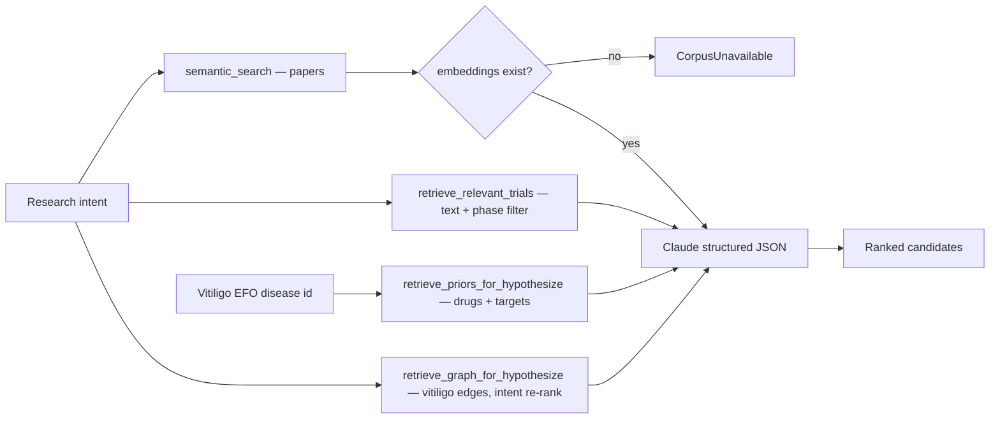
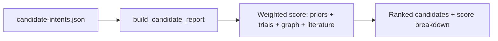
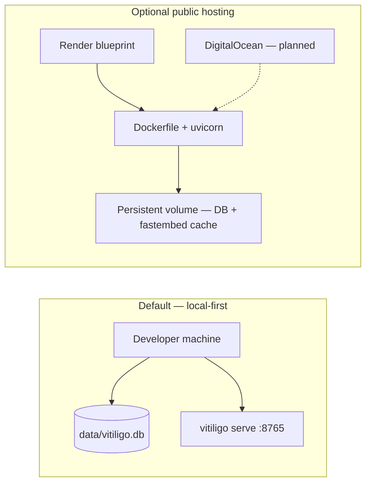

# Evidence Engine — Architecture

Canonical diagrams for the **software** stack (ingestion → storage → search → reasoning → web). For mission-level strategy loops and artifact maps, see the Mermaid diagrams in the [README](../README.md). For commands and module detail, see [`engine.md`](engine.md).

---

## System architecture (five layers)

The stack is five **data/processing** layers, deliberately small and swappable. **Serving** (CLI + FastAPI) is not a sixth data layer — it exposes layers 1–5. Batch jobs (`ingest`, `embed run`, `graph seed`) run on a developer machine or CI; `vitiligo serve` is read-heavy plus optional LLM POSTs.

```
┌──────────┐    ┌──────────┐    ┌──────────┐    ┌──────────┐    ┌──────────┐
│ External │ ─► │ Ingestion│ ─► │ Document │ ─► │ Embeddings│ ─► │ Reasoning│
│ sources  │    │ pipeline │    │ store    │    │ + semantic│    │ (RAG +   │
│ (PubMed, │    │ +        │    │ (SQLite) │    │ search    │    │ hypothesis│
│  PMC, …) │    │ bookkeep │    │          │    │ fastembed)│    │ Anthropic)│
└──────────┘    └──────────┘    └──────────┘    └──────────┘    └──────────┘
                     │               │                               │
                     │               │ graph seed (priors + trials)  │
                     │               │ graph extract (docs, opt. LLM)│
                     │               └───────────────────────────────┘
                     ▼
              ┌──────────────┐    ┌──────────────┐
              │ vitiligo CLI │    │ FastAPI web  │
              │ (operator)   │    │ + HTML UI    │
              └──────────────┘    └──────────────┘
```

Same stack as Mermaid (renders on GitHub):



| Layer | Package | Responsibility |
|-------|---------|----------------|
| Sources | `vitiligo.sources` | Fetch and parse PubMed, PMC, registries, Open Targets, DrugBank, GEO, ICTRP |
| Ingestion | `vitiligo.ingest` | Upsert by `(source, source_id)`; `ingestion_runs` audit trail |
| Storage | `vitiligo.storage` | SQLModel schema: documents, embeddings, trials, priors, graph |
| Graph build | `vitiligo.graph` | `graph seed` (deterministic); `graph extract` (optional LLM) — **not** part of ingest |
| Embeddings | `vitiligo.embed` | `embed run` indexes documents; `semantic_search`; model `BAAI/bge-small-en-v1.5` |
| Evidence | `vitiligo.evidence` | Paper/trial tiers; score penalties in search (mouse −0.08, in vitro −0.05) |
| Reasoning | `vitiligo.reasoning` | RAG Ask and Hypothesize (requires `ANTHROPIC_API_KEY`) |
| Reports | `vitiligo.reports` | Deterministic candidate rankings (`report candidates`, `/api/report/candidates`) |
| Web | `vitiligo.web` | FastAPI JSON API + vanilla static UI |
| CLI | `vitiligo.cli` | Operator console: ingest, embed, graph, serve — same engine as the API |

Query helpers on storage (no separate layer): `vitiligo.trials`, `vitiligo.priors`, `vitiligo.graph.query`.

---

## High-level data flow

End-to-end runtime path. **Ingest does not embed documents or build the graph** — those are separate CLI steps after the corpus is loaded.



**Operational order (typical):** `db init` → `ingest *` → `embed run` → `graph seed` → (`graph extract`) → `serve`.

**Coupling note:** `generate_hypotheses` and `build_candidate_report` both require embeddings (`semantic_search`). If the index is empty, hypothesize fails entirely; candidate reports lack literature scores.

---

## Hypothesize evidence streams

`generate_hypotheses` combines four retrieval streams, then one Claude call for structured JSON.



Citation conventions: paper `[n]`, trial `[Tn]`, prior `[Pn]`, graph `[Gn]`.

---

## Candidate reports (deterministic)

Parallel to Hypothesize — scoring is **deterministic** (no Claude for rankings). Requires **`embed run`** like search/Hypothesize, because literature evidence uses `semantic_search`. Optional LLM narrative synthesis is available in the CLI when `ANTHROPIC_API_KEY` is set (`include_llm=True`).



Exposed as `vitiligo report candidates` and `GET /api/report/candidates` (web endpoint is always deterministic).

---

## Deployment and runtime

Default posture is **local-first** (`vitiligo serve` + `data/vitiligo.db`). Optional public hosting uses Docker with a persistent volume for the corpus and embedding cache. **`fly.toml` exists but Fly.io is deprecated** — see [`deploy.md`](deploy.md).



---

## Web API surface

| Method | Path | LLM required |
|--------|------|----------------|
| GET | `/`, `/privacy`, `/terms` | No |
| GET | `/api/health`, `/api/stats` | No |
| POST | `/api/search` | No |
| POST | `/api/ask` | Yes |
| POST | `/api/hypothesize` | Yes |
| GET | `/api/report/candidates` | No |
| POST | `/api/trials/search` | No |
| GET | `/api/trials/stats` | No |
| GET | `/api/graph/stats` | No |
| GET | `/api/graph/search` | No |
| GET | `/api/graph/neighbors` | No |
| GET | `/api/graph/export` | No |

POST routes under `/api/*` are rate-limited per IP in production (`VITILIGO_RATE_LIMIT_POST_PER_MINUTE`).

---

## Related docs

- [`engine.md`](engine.md) — quickstart, source modules, CLI reference
- [`deploy.md`](deploy.md) — hosting posture and env vars
- [README](../README.md) — mission, strategic logic, artifact map (non-software diagrams)
