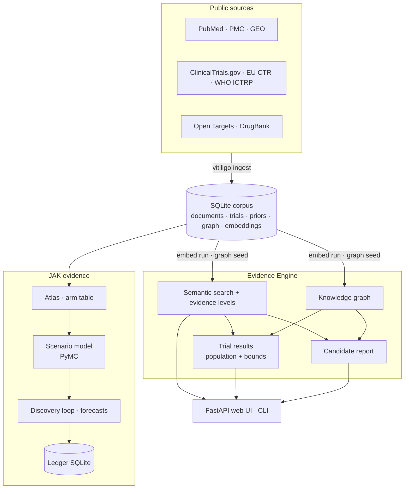

# Architecture

How the software fits together. Commands are in [`engine.md`](engine.md); hosting is in [`deploy.md`](deploy.md).

## Data flow

```mermaid
flowchart TB
  subgraph sources [Public sources]
    S1[PubMed · PMC · GEO]
    S2[ClinicalTrials.gov · EU CTR · WHO ICTRP]
    S3[Open Targets · DrugBank]
  end

  DB[(SQLite corpus<br/>documents · trials · priors · graph · embeddings)]

  subgraph engine [Evidence Engine]
    SEARCH[Semantic search + evidence levels]
    GRAPH[Knowledge graph]
    EVID[Trial results<br/>population + bounds]
    CAND[Candidate report]
  end

  subgraph jak [JAK evidence]
    ATLAS[Atlas · arm table]
    MODEL[Scenario model<br/>PyMC]
    LOOP[Discovery loop · forecasts]
    LEDGER[(Ledger SQLite)]
  end

  sources -->|vitiligo ingest| DB
  DB -->|embed run · graph seed| SEARCH & GRAPH
  SEARCH & GRAPH --> EVID & CAND
  DB --> ATLAS --> MODEL --> LOOP --> LEDGER
  SEARCH & EVID & CAND --> UI[FastAPI web UI · CLI]
```

Typical order: `db init` → `ingest …` → `embed run` → `graph seed` → `serve`. Ingest does not embed or build the graph; those are separate steps. Every step is deterministic: the engine calls no model API, so the same corpus reproduces the same output.

## Modules

| Package | Responsibility |
|---|---|
| `vitiligo.sources` | Fetch and parse each public source into a source-agnostic schema; raw responses kept in `raw_metadata`. Includes human genetics (`gwas.py`) and GEO supplementary data files (`geo_files.py`) |
| `vitiligo.ingest` | Idempotent upserts by `(source, source_id)`; `ingestion_runs` audit trail; `db repair` |
| `vitiligo.storage` | SQLModel schema: documents, embeddings, trials, priors, graph |
| `vitiligo.embed` | fastembed ONNX embeddings (`BAAI/bge-small-en-v1.5`), brute-force cosine search. Two indexes: one vector per document over title and abstract, and one per passage of a paper's body (`chunking.py`, `full_text.py`), where a document scores as its best passage |
| `vitiligo.evidence` | Evidence levels for papers and trials; search down-ranks mouse (−0.08) and in-vitro (−0.05) studies |
| `vitiligo.graph` | `graph seed` from priors and trials (deterministic); `graph seed-evidence` from GWAS associations, trial results and mechanism records. Every edge records whether it is **asserted** (a source states it) or **observed** (measured), and an observed one carries its rung on the causal ladder |
| `vitiligo.trials`, `vitiligo.priors` | Query helpers over the store |
| `vitiligo.reports` | Candidate report (deterministic); JAK atlas (`jak.py`); harmonized arm table (`jak_arms.py`); curated paper results (`paper_results.py`); the clinician trial-results table (`clinical.py`) and partial-identification bounds (`bounds.py`) |
| `vitiligo.models` | Scenario model (`jak_mbma.py`); needs the `[model]` extra |
| `vitiligo.mechanisms` | Mechanistic hypothesis records (`curation/mechanisms.json`): the chain, the causal ladder, and the gate (`verify.py`) |
| `vitiligo.discovery` | e-values and e-LOND (`evidence.py`), ledger, policy, loop, forecasts of unreported trials |
| `vitiligo.web` | FastAPI app, static UI, rate limiting, proxy headers. Serves stored records only; it calls no model API |
| `vitiligo.cli` | Typer CLI over all of the above |

## Web API

Every route answers from the stored corpus. There is no model API client in the
engine, so there is nothing to key, meter or budget.

| Method | Path |
|---|---|
| GET | `/`, `/privacy`, `/terms` |
| GET | `/api/health`, `/api/stats` |
| GET | `/api/evidence` (week-24 trial results with populations and bounds; built at startup, cached until the corpus changes) |
| POST | `/api/search` |
| GET | `/api/report/candidates` (cached until the corpus changes) |
| POST | `/api/trials/search` |
| GET | `/api/trials/stats` |
| GET | `/api/graph/stats`, `/api/graph/search`, `/api/graph/neighbors`, `/api/graph/export` |

POST routes are rate-limited per client. Provenance naming a source whose terms
forbid redistribution is filtered out of responses.
